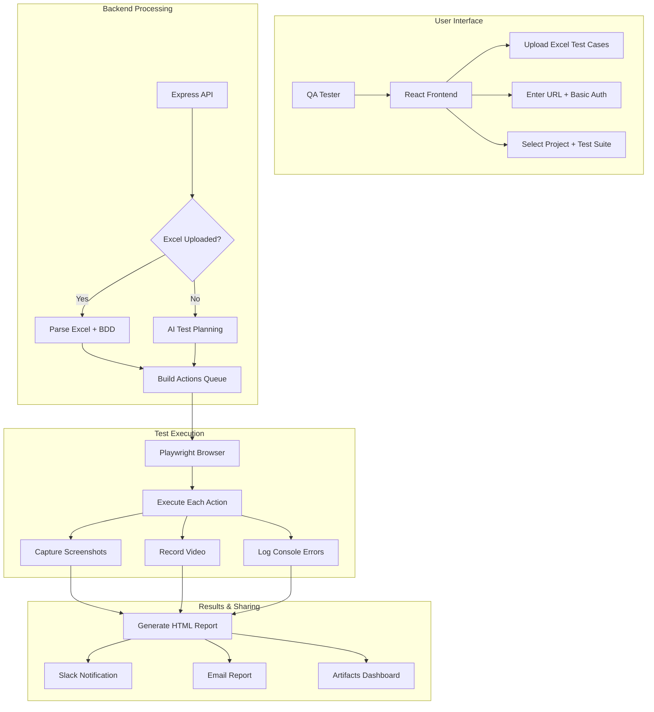

# QA Testing Agent - Explainable Model

## 🎯 What Problem Does This Solve?

**Traditional QA Testing Issues:**
- Manual testing is slow and error-prone
- No visual evidence of test execution
- Hard to share results with stakeholders
- Test cases scattered across documents
- No automated regression testing

**Our Solution:**
- Automated browser testing with human-readable BDD steps
- Visual artifacts (screenshots + videos) for every action
- Excel-based test case management
- AI-powered test planning (when needed)
- Instant sharing via Slack/Email + HTML reports

## 🏗️ High-Level Architecture



## 🔄 Detailed Workflow Explanation

### Phase 1: Test Setup
1. **User selects project** (Lavinia, passagePrep, teachingChannel)
2. **Chooses test suite** (exploratory, smoke, regression, feature)
3. **Provides target** (URL or screenshot)
4. **Optional: Uploads Excel file** with BDD test cases
5. **Optional: Sets Basic Auth** credentials

### Phase 2: Test Planning
**If Excel uploaded:**
- Backend reads the worksheet matching the selected suite
- Parses "Test Script (BDD)" column
- Converts BDD text to executable actions:
  - "navigate to https://example.com" → `action: navigate, value: URL`
  - "hover over Menu" → `action: hover, text: Menu`
  - "click Submit" → `action: click, text: Submit`

**If no Excel:**
- AI analyzes the target (URL/screenshot)
- Generates test plan based on project profile
- Creates action queue for automated exploration

### Phase 3: Test Execution
1. **Browser Launch**: Playwright starts with video recording
2. **Action Processing**: Each action from the queue is executed:
   - **Navigate**: Go to specified URL
   - **Click**: Find element by text/selector and click
   - **Fill**: Input data into forms
   - **Hover**: Mouse over elements to trigger menus
   - **Assert**: Verify expected text appears
3. **Artifact Capture**: Screenshot after each action
4. **Error Handling**: Log any failures, continue with next action

### Phase 4: Results Generation
1. **HTML Report**: Professional-looking test summary
2. **Assets Index**: Browse all screenshots and videos
3. **Action Log**: Step-by-step execution details
4. **Pass/Fail Summary**: Quick overview of test results

## 📊 Excel Test Case Format

### Sheet Structure
```
Worksheet Name: regression (must match test suite)

| Test Case ID | Test Script (BDD)                    |
|--------------|--------------------------------------|
| DP-T2151     | Given a valid user is logged in     |
|              | When navigating to the dashboard    |
|              | And the user hovers over RISE menu  |
|              | Then the submenu pages will appear  |
|              | When selecting "Training"           |
|              | Then the training page loads        |
```

### BDD Step Patterns Supported
- **Navigation**: `navigate to https://example.com`
- **Interaction**: `click Submit button`, `hover over Menu`
- **Input**: `fill Email with user@example.com`
- **Verification**: `Then the page loads successfully`
- **Keyboard**: `press Enter`, `press Tab`

## 🎬 What Happens During Execution

### Visual Example
```
Step 1: navigate to https://lavinia.com
├── Browser opens
├── Navigates to URL
├── Screenshot: 01_navigate.png
└── Video: records entire session

Step 2: hover over "RISE Curriculum"
├── Mouse moves to element
├── Submenu appears
├── Screenshot: 02_hover.png
└── Video: continues recording

Step 3: click "Training"
├── Clicks the element
├── Page navigates
├── Screenshot: 03_click.png
└── Video: continues recording
```

## 📈 Benefits & Use Cases

### For QA Teams
- **Faster Testing**: Automated execution of repetitive tests
- **Better Coverage**: Systematic testing of all user flows
- **Visual Evidence**: Screenshots and videos for every step
- **Easy Maintenance**: Update test cases in Excel, not code

### For Stakeholders
- **Clear Reports**: Professional HTML reports with pass/fail
- **Instant Sharing**: Slack/Email notifications with links
- **Audit Trail**: Complete record of what was tested
- **Regression Safety**: Consistent test execution every time

### For Developers
- **Bug Reproduction**: Visual evidence of issues
- **Regression Testing**: Automated validation of fixes
- **Performance Monitoring**: Console error capture
- **Cross-Browser**: Easy to extend to multiple browsers

## 🚀 How to Use in Your Presentation

### Slide 1: Problem Statement
"Manual QA testing is slow, error-prone, and lacks evidence"

### Slide 2: Solution Overview
"Our QA Agent automates testing while maintaining human-readable test cases"

### Slide 3: How It Works
Show the workflow diagram and explain the 4 phases

### Slide 4: Excel Integration
"Test cases written in natural language, executed automatically"

### Slide 5: Results & Benefits
"Professional reports, instant sharing, complete audit trail"

### Slide 6: Live Demo
Show the actual system running with your Excel test cases

## 🔧 Technical Implementation Details

### Frontend (React + Vite)
- Project selection interface
- Test suite configuration
- File upload handling
- Real-time status updates

### Backend (Node.js + Express)
- Excel parsing with xlsx library
- BDD text analysis and action generation
- Playwright orchestration
- Report generation

### Test Runner (Playwright)
- Browser automation
- Video recording
- Screenshot capture
- Error logging

### Notifications
- Slack webhook integration
- SMTP email delivery
- HTML report generation
- Asset serving

## 📝 Key Takeaways for Your Audience

1. **Human-Readable**: Test cases written in natural language
2. **Automated Execution**: Browser actions happen automatically
3. **Visual Evidence**: Screenshots and videos for every step
4. **Easy Sharing**: Instant notifications and professional reports
5. **Maintainable**: Update test cases in Excel, not code
6. **Scalable**: Works with existing test case management
7. **Professional**: Enterprise-grade reporting and notifications
